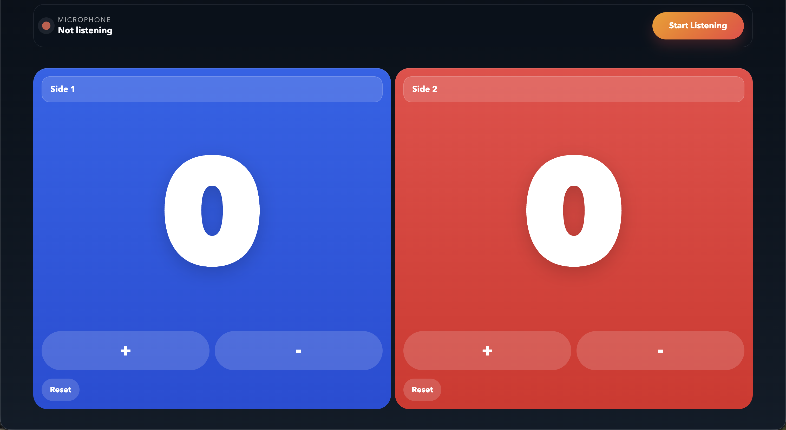

# Ping Pong Counter



A voice-activated scoreboard for two-sided competitions — ping pong, debates, sports, or anything else. Control scores hands-free with voice commands, or use the on-screen buttons.

## Features

- Say a side name to increment its score instantly
- Reset scores by voice
- Manual +/- buttons as fallback
- Customizable side names (used as voice targets)
- Scores saved across sessions
- Fuzzy matching catches common speech recognition mishearings
- Auto-restarts mic after silence — no need to click again mid-game

## Voice Commands

| Action | What to say |
|---|---|
| Increment | Just say the side name — e.g. "Red" or "Blue" |
| Reset one side | "reset Red" / "clear Blue" / "zero Red" |
| Reset all | "reset all" / "clear both" |

Side names are set by you — whatever you name each side becomes the voice trigger.

## Development

```bash
npm install
npm run dev
```

## Tests

```bash
npm run test
```

## Tech Stack

- Vite + TypeScript
- Vitest + fast-check (property-based testing)
- Web Speech API
- Deployed via Cloudflare Pages
